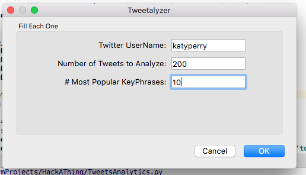
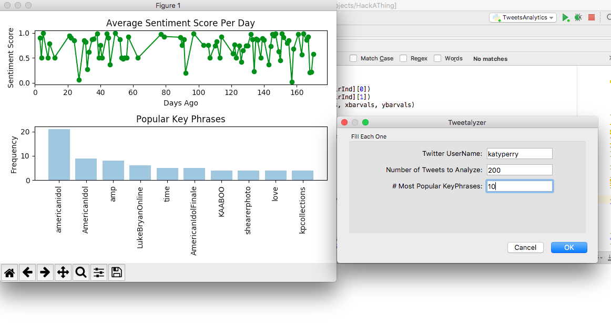
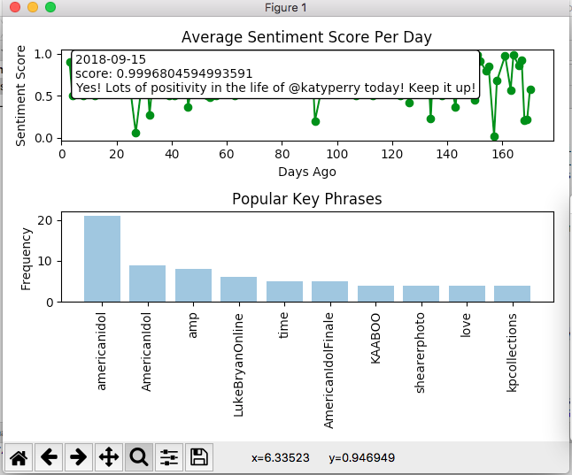

# CS98 hack-a-thing-1-solomo
## Moyo Okeremi, September 2018
### Tweetalyzer - Personal Tweet Analyzer

#### Description
Tweetalyzer is a python application that enables the user to input a twitter username, number of tweets they want analyzed, and limit of most popular key phrases encountered in the the analyzed tweets. It then performs sentiment analyses on each tweet and calculates the average sentiment score per day. It presents this information in a graph with:

x axis- stating at 0 representing present day, and continues on representing how many days away from present day

y axis- sentiment analysis score with 0 = negative sentiment, 1 = positive sentiment

For each point plotted on the graph, hovering over it displays the date point corresponds to, average sentiment analysis score that day, and a comment mapped to whatever sentiment analysis score group.
Clicking on any of the plotted points, opens up a message box that displays the tweets from that date and their corresponding score.

It also performs key phrase extraction for each tweet analyzed and then displays top N key phrases encountered in a bar graph, where N is the number specified by the user.

There is also some error checking that pops up error message boxes if the input fields aren't filled correctly or if the username entered does not exist.

#### What It Entails
In this assignment I worked on understanding text analytics cognitive services provided by Microsoft Azure.
Text Analytics service provides advanced natural language processing for raw unstructured text. It includes four main functions: sentiment analysis, key phrase extraction, language detection, and entity linking. For this assignment I used only the sentiment analysis and key phrase extraction features. I used twitter API for the first time in order to get access to tweets which I believed would be interesting to analyze.
I also worked on interactive data visualization with python for the first time as well as working pyQt5 for GUI in python which i have also never done before. I didn't follow any specific tutorial for this assignment but designed something I wanted to do with inspiration from sites. Therefore 70% of the code is logic and hand-written code, with some stack overflow help as well and 30% is bits and pieces from websites showing how to use the APIs and graphing.






#### Difficulties
Working with ```matplotlib``` for graphing was more challenging than I anticipated and took hour to figure out. Documentation online was not easy to follow or sometimes was non-existent/not updated.
I initially wanted to be able to do something with retrieving tweets within a certain time frame, but the twitter API is very limiting and does not allow for this which forced me to change directions.
Also the fact that I did not follow any specific tutorial (as the initial tutorial I found that inspired me to analyze tweets was not something I could submit), made structuring the project a little bit tough as things were constantly changing along the way as I discovered ideas were not as feasible.

#### Observations
Sentiment Analysis on sentences is sometimes very incorrect and something as little as changing a comma, could drastically change the sentiment analysis score which was very interesting to me. Cognitive services still need to make strides towards understanding natural language and since twitter is such an informal platform filled with much more colloquialism, the results are probably not as accurate as I would like

#### Sources and Inspirations
https://docs.microsoft.com/en-us/azure/stream-analytics/stream-analytics-twitter-sentiment-analysis-trends (initial inspiration)

http://adilmoujahid.com/posts/2014/07/twitter-analytics/

https://www.taygan.co/blog/2018/01/18/text-analytics-with-microsoft-cognitive-services

https://developer.twitter.com/en/docs/tweets/timelines/api-reference/get-statuses-user_timeline.html

https://stackoverflow.com/questions/7908636/possible-to-make-labels-appear-when-hovering-over-a-point-in-matplotlib

https://pythonspot.com/pyqt5-form-layout/
